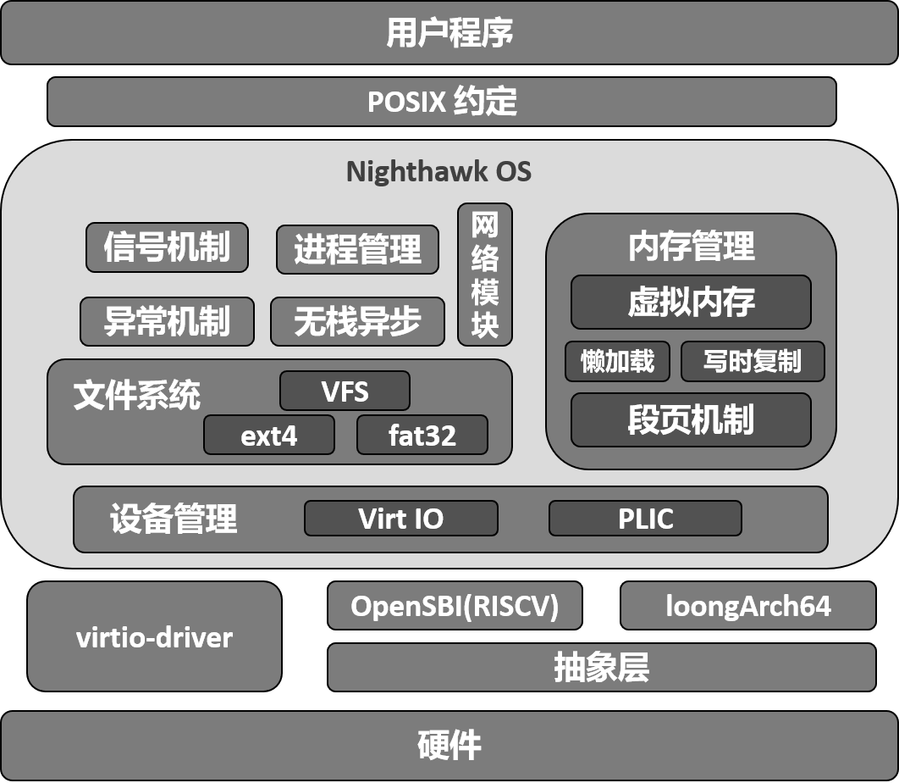

# Nighthawk OS

## 项目描述

Nighthawk OS 是使用 Rust 编写，支持 RISC-V 和 LoongArch 指令集架构，采用异步无栈协程架构的操作系统。

## 完成情况

### 初赛

<!-- 这里写完成测例情况，并在assets文件夹下放一张得分榜截图leaderboard-pre.png -->
<!--   -->

### 功能介绍
<!--  这里复制了Phoenix的，请检查修改自己了解的部分，为避免重复可以重构或添加模块 -->
- 无栈协程：基于rust的future机制实现的无栈进程切换，能够在进程之间快速地切换调度，多核间以M:N调度算法对进程调度，充分发挥多核优势。
- 进程管理：统一的进程线程抽象，方便内核管理的同时增强进程与线程对于POSIX的兼容性。
- 内存管理：实现基本的内存管理功能。使用懒分配和 Copy-on-Write 优化策略。支持共享内存区域映射，便于高效的进程间通信和资源共享。
- 文件系统：基于 Linux 设计的虚拟文件系统。实现页缓存加速文件读写，实现 Dentry 缓存加速路径查找。支持 FAT32（基于 rust-fatfs）和 Ext4（基于 lwext4-rust）等主流文件系统。
- 进程通信：实现了符合POSIX标准的信号系统，支持用户自定义信号处理例程；实现了共享内存通信，适配内核其他异步功能。
- 设备驱动：支持设备树解析，自动化设备发现与配置。实现 PLIC 支持，异步处理中断事件，提升外设响应速度。
- 网络模块：模块化设计，支持灵活扩展Udp，Tcp等多种网络协议。异步事件处理框架与多核调度协同工作，确保网络通信在复杂应用场景下高效可靠。



### 项目文档

<!--  [Nighthawk-初赛文档](./Nighthawk-初赛文档.pdf) -->

## 运行方式

非比赛环境，可于主目录下

- 键入 `make build2docker` 即可构建docker环境，

- 键入 `make docker` 即可进入docker环境，

- 键入 `make user` 即可编译用户程序，

- 键入 `make fs-img` 即可构建本地测例与依赖库的磁盘环境，用于`make run*`的挂载

- 键入 `make run ARCH=riscv64/loongarch64` 即可编译运行内核，并挂载本地的磁盘文件

- 键入 `make run-debug` 即可运行debug模式，此模式下会打印when_debug!宏的输出

比赛环境，可于主目录下

- 键入 `make dkernel` 即可编译执行riscv架构的内核，会挂载比赛环境的磁盘文件`sdcard-rv.img`

- 键入 `make lkernel` 即可编译执行loongarch架构的内核，会挂载比赛环境的磁盘文件`sdcard-la.img`

- 键入 `make all` 即可同时编译riscv和loongarch架构的内核，并复制于主目录下，用于比赛平台的评测

目前项目代码结构如下图，内核项目代码主要位于 `kernel` 和 `lib` 目录下。
<!-- 这里后来新加的文件夹我还没有细看，可以考虑进一步细化 -->
```
.
├──docs                   ---- 文档
├──submit                 ---- 提交平台依赖文件
├──img-data               ---- 本地磁盘依赖文件
├──testcase               ---- 本地磁盘测试文件
├──kernel
│  ├── build.rs           ---- link.ld地址替换
│  ├── Cargo.toml         ---- 项目cargo设置
│  ├── link.ld            ---- 链接脚本
│  ├── Makefile           ---- 编译配置
│  └── src
│      ├── boot.rs        ---- 启动多cpu 
│      ├── lang_item.rs   ---- 崩溃处理
│      ├── linkapp-la.asm ---- 链接内部应用(LoongArch)
│      ├── linkapp-rv.asm ---- 链接内部应用(RISC-V)
│      ├── loader.rs      ---- 加载应用
│      ├── logging.rs     ---- 日志打印函数
│      ├── main.rs        ---- 主函数
│      ├── entry          ---- 多架构入口函数
│      ├── net            ---- 网络系统调用
│      ├── osdriver       ---- 操作系统驱动
│      ├── processor      ---- 处理器
│      ├── syscall        ---- 系统调用
│      ├── task           ---- 任务
│      ├── trap           ---- 中断处理
│      └── vm             ---- 虚拟内存
├──lib
│  ├── arch               ---- 特定架构汇编封装
│  ├── config             ---- 配置数据文件
│  ├── driver             ---- 驱动抽象
│  ├── executor           ---- 异步任务执行器
│  ├── ext4               ---- EXT4文件系统支持
│  ├── fat32              ---- FAT32文件系统支持
│  ├── id_allocator       ---- id分配器
│  ├── logger             ---- 日志输出
│  ├── mm                 ---- 内存管理
│  ├── mutex              ---- 互斥锁
│  ├── net                ---- 网络模块
│  ├── osfs               ---- 操作系统文件系统接口
│  ├── osfuture           ---- 异步支持
│  ├── polyhal-macro      ---- 架构抽象代码宏
│  ├── pps                ---- cpu特权寄存器存储
│  ├── shm                ---- 共享内存
│  ├── simdebug           ---- 简单的调试支持
│  ├── systype            ---- 系统错误类型
│  ├── timer              ---- 定时器
│  └── vfs                ---- 虚拟文件系统
├──user
│  ├── Cargo.toml
│  ├── Makefile
│  └── src
│      ├── bin            ---- 内核加载测试文件
│      ├── console.rs     ---- 输出
│      ├── error.rs       ---- 错误处理
│      ├── lang_items.rs  ---- panic实现
│      ├── lib.rs         ---- 库函数
│      ├── linker.ld      ---- 链接规则
│      └── syscall.rs     ---- 系统调用对接
├── vendor                ---- 第三方库目录
├── target                ---- 编译产出目录
├── Cargo.lock
├── Cargo.toml
├── Dockerfile
├── Makefile
├── README.md
└── rust-toolchain.toml
```

## 项目人员

哈尔滨工业大学（深圳）:

- 关雄正 (<echudet@163.com>)：进程管理、内核文件系统设计、网络模块、驱动设计
- 王峻阳 (<adong660@foxmail.com>)：内存管理、虚拟文件系统设计、内存多架构设计
- 冼志炜 (<18023803967@163.com>)：异常机制、进程间通信、trap多架构设计
- 指导老师：夏文，仇洁婷

<!-- 参考部分，我们基本只参考了 byteOS 的 HAL 和 Phoenix，写出来不太好看，不知道怎么处理 -->
