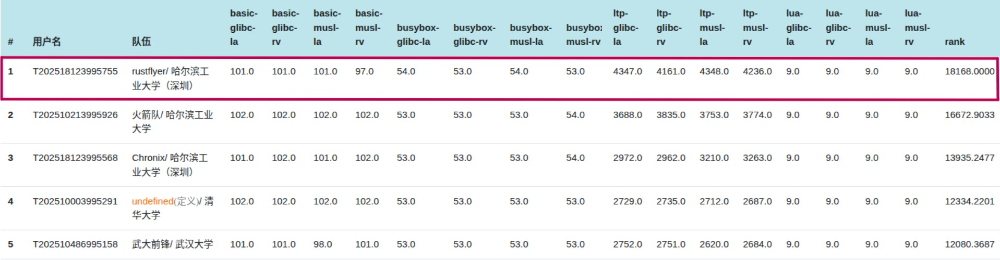

# Nighthawk OS

## 项目描述

Nighthawk OS 是使用 Rust 编写，支持 RISC-V 和 LoongArch 指令集架构，采用异步无栈协程架构的操作系统，追求系统功能的标准化和完备性。

## 完成情况

### 初赛

在初赛结束时位于排行榜第七：


### 决赛

Nighthawk OS 已通过所有决赛第一阶段测例，取得满分：


在决赛提交截止时初赛测例分数位于排行榜第一：



### 功能介绍

- 无栈协程：基于rust的future机制实现的无栈进程切换，能够在进程之间快速地切换调度，多核间以M:N调度算法对进程调度，充分发挥多核优势。
- 进程管理：统一的进程线程抽象，方便内核管理的同时增强进程与线程对于POSIX的兼容性。
- 内存管理：实现基本的内存管理功能。使用懒分配和 Copy-on-Write 优化策略。支持共享内存区域映射，便于高效的进程间通信和资源共享。
- 文件系统：基于 Linux 设计的虚拟文件系统。实现页缓存加速文件读写，实现 Dentry 缓存加速路径查找。支持 FAT32（基于 rust-fatfs）和 Ext4（基于 lwext4-rust）等主流文件系统。
- 进程通信：复用一部分Phoenix的代码，实现了符合POSIX标准的信号系统，支持用户自定义信号处理例程；实现了共享内存通信，适配内核其他异步功能；实现了等待队列机制。
- 设备驱动：支持设备树解析，自动化设备发现与配置。实现 PLIC 支持，异步处理中断事件，提升外设响应速度。
- 网络模块：复用一部分Phoenix和Arceos的代码，并在此基础上进行优化。模块化设计，支持灵活扩展Udp，Tcp等多种网络协议。异步事件处理框架与多核调度协同工作，确保网络通信在复杂应用场景下高效可靠。

在这些功能的基础上， Nighthawk OS 能够支持基本的实用程序运行，比如vim编辑器、git版本管理器，以及能够在内核中使用gcc本地编译并运行简单的程序，如“贪吃蛇”等。

### 特色创新

*异步协程架构*：采用基于 Rust async/await 的异步协程调度模型，每个用户任务运行在独立的异步执行单元中，提供了比传统线程模型更高的并发性能和更低的资源消耗。

*跨架构设计*：通过模块化设计和条件编译，实现对 RISC-V 和 LoongArch 架构的统一支持。同一份内核代码可以在不同硬件平台(qemu，riscv星光板，loongArch星云板)上编译运行，大大提高了代码的复用性和可维护性。

*更多的系统调用*： Nighthawk通过对内部功能的完善，支持了近两百个系统调用，满足大部分程序的运行环境需求。

*零拷贝用户指针处理*：基于硬件 MMU 实现了高效的用户指针合法性检查，支持内核态直接访问用户地址空间，避免了传统的软件地址翻译和数据拷贝开销。

*文件系统监控*：对文件的各个操作进行统一的监控，包括读写增改，能够统计文件的信息。

*log管理*：灵活的log调试输出，能够根据条件变化打开关闭，或是过滤或选择一些相应的输出，为调试工作提供便利。

<div align="center">
  
</div>

### 项目文档

- [Nighthawk-决赛文档](./NighthawkOS决赛文档.pdf)

- [Nighthawk-决赛幻灯片](./NighthawkOS决赛幻灯片.pptx)

- [Nighthawk-初赛文档](./NighthawkOS初赛文档.pdf)

- [Nighthawk-初赛幻灯片](./NighthawkOS初赛幻灯片.pptx)

- [Nighthawk-初赛展示视频](https://pan.baidu.com/s/1VokWbcV22oiYtDVE2q8Nyg) 提取码: rqs5

## 运行方式

**非比赛环境**，可于主目录下

- 键入 `make unzip` 即可解压项目的vendor依赖库

- 键入 `make fs-img ARCH=riscv64/loongarch64` 即可构建本地测例与依赖库的磁盘环境，用于`make run*`的挂载

- 键入 `make run ARCH=riscv64/loongarch64 (LOG=?可选)` 即可编译运行内核，并挂载本地的磁盘文件

- 键入 `make build2docker` 即可构建docker环境(可选)

- 键入 `make docker` 即可进入docker环境(可选)

**比赛环境**，可于主目录下（磁盘文件需要提供）

- 键入 `make rkernel` 即可编译执行riscv架构的内核，会挂载比赛环境的磁盘文件`sdcard-rv.img`

- 键入 `make lkernel` 即可编译执行loongarch架构的内核，会挂载比赛环境的磁盘文件`sdcard-la.img`

- 键入 `make all` 即可同时编译riscv和loongarch架构的内核，并复制于主目录下，用于比赛平台的评测

目前项目代码结构如下图，内核项目代码主要位于 `kernel` 和 `lib` 目录下。

```
.
├──docs                   ---- 文档
├──submit                 ---- 提交平台依赖文件
├──img-data               ---- 本地磁盘依赖文件
├──testcase               ---- 本地磁盘测试文件
├──kernel
│  ├── build.rs           ---- link.ld地址替换
│  ├── Cargo.toml         ---- 项目cargo设置
│  ├── link.ld            ---- 链接脚本
│  ├── Makefile           ---- 编译配置
│  └── src
│      ├── boot.rs        ---- 启动多cpu 
│      ├── lang_item.rs   ---- 崩溃处理
│      ├── linkapp.asm.tmpl ---- 链接内置用户程序之模板
│      ├── loader.rs      ---- 加载应用
│      ├── logging.rs     ---- 日志打印函数
│      ├── main.rs        ---- 主函数
│      ├── entry          ---- 多架构入口函数
│      ├── net            ---- 网络系统调用
│      ├── osdriver       ---- 操作系统驱动
│      ├── processor      ---- 处理器
│      ├── syscall        ---- 系统调用
│      ├── task           ---- 任务
│      ├── trap           ---- 中断处理
│      └── vm             ---- 虚拟内存
├──lib
│  ├── arch               ---- 特定架构汇编封装
│  ├── config             ---- 配置数据文件
│  ├── driver             ---- 驱动抽象
│  ├── executor           ---- 异步任务执行器
│  ├── ext4               ---- EXT4文件系统支持
│  ├── fat32              ---- FAT32文件系统支持
│  ├── id_allocator       ---- id分配器
│  ├── logger             ---- 日志输出
│  ├── mm                 ---- 内存管理
│  ├── mutex              ---- 互斥锁         
│  ├── net                ---- 网络模块      
│  ├── osfs               ---- 操作系统文件系统接口
│  ├── osfuture           ---- 异步支持
│  ├── polyhal-macro      ---- 架构抽象代码宏  
│  ├── pps                ---- cpu特权寄存器存储
│  ├── shm                ---- 共享内存
│  ├── simdebug           ---- 简单的调试支持
│  ├── systype            ---- 系统错误类型    
│  ├── timer              ---- 定时器
│  └── vfs                ---- 虚拟文件系统
├──user                                      
│  ├── Cargo.toml
│  ├── Makefile
│  └── src
│      ├── bin            ---- 内核加载测试文件
│      ├── console.rs     ---- 输出
│      ├── error.rs       ---- 错误处理
│      ├── lang_items.rs  ---- panic实现
│      ├── lib.rs         ---- 库函数
│      ├── linker.ld      ---- 链接规则
│      └── syscall.rs     ---- 系统调用对接    
├── vendor                ---- 第三方库目录
├── target                ---- 编译产出目录
├── Cargo.lock
├── Cargo.toml
├── Dockerfile
├── Makefile
├── README.md
└── rust-toolchain.toml
```

## 项目人员

哈尔滨工业大学（深圳）:

- 关雄正 (<echudet@163.com>)：进程管理、内核文件系统设计、网络模块、驱动设计
- 王峻阳 (<adong660@foxmail.com>)：内存管理、虚拟文件系统设计、内存多架构设计
- 冼志炜 (<18023803967@163.com>)：异常机制、进程间通信、trap多架构设计
- 指导老师：夏文，仇洁婷

## 参考

- [PhoenixOS](https://github.com/oscomp/first-prize-osk2024-phoenix): 网络, 进程通信
- [TitanixOS](https://gitlab.eduxiji.net/202318123101314/oskernel2023-Titanix): 锁
- [MinotaurOS](https://github.com/oscomp/first-prize-osk2024-minotauros): 异步协程调度
- [rcore-os/rCore](https://github.com/rcore-os/rCore): 用户态程序
- [polyhal](https://github.com/Byte-OS/polyhal): 多架构设计
- [PhoenixOS](https://github.com/oscomp/first-prize-osk2024-phoenix)、 [MankorOS](https://gitlab.eduxiji.net/MankorOS/OSKernel2023-MankorOS): 设计文档
